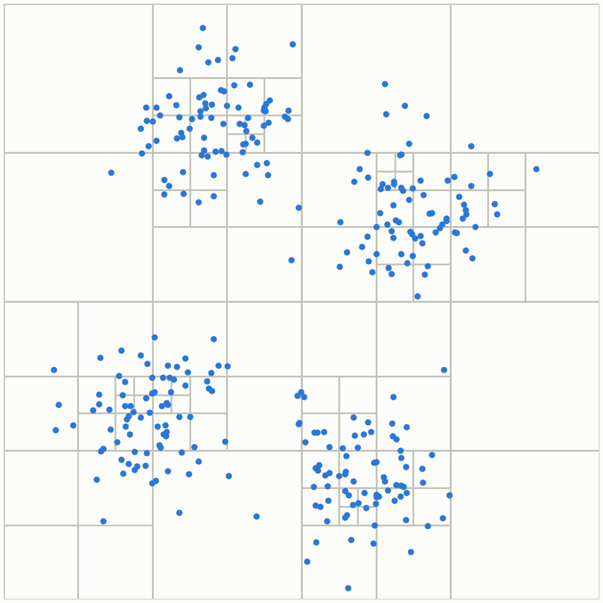

# fmmgen


[](https://doi.org/10.5281/zenodo.3842591)
[](https://arxiv.org/abs/2005.12351)
[](https://github.com/rpep/fmmgen/actions/workflows/actions.yml)

<p align="center">
  
</p>
<p align="center"><sub>An adaptive quadtree built from a clustered particle distribution, the kind fmmgen's
generated operators and example tree code operate on.</sub></p>

Hand-deriving Cartesian multipole operators for a Fast Multipole or Barnes-Hut code is
tractable up to about 3rd order for simple monopole sources, and a serious undertaking
beyond that - the algebra gets markedly worse again if your sources are dipoles,
quadrupoles, or higher, which is why most Cartesian FMM/Barnes-Hut implementations
you'll find are stuck at low order and monopole sources only. fmmgen does the derivation
symbolically with SymPy, to whatever expansion order and source order you ask for, and
emits optimized C, C++, or CUDA code for the result: common-subexpression elimination,
exploitation of the Laplace Green's function's harmonicity, and an optional trace-free
("harmonic compression") basis all reduce the operator's operation count before it ever
reaches your compiler.

Generating the operators is only half the problem, so fmmgen also ships a complete,
OpenMP-parallelised reference implementation of both the FMM and Barnes-Hut tree and
traversal in the `example` folder, built around the generated operators, that you can
drop straight into your own code rather than writing a tree code from scratch.

fmmgen was originally written as part of the PhD research of Ryan Alexander Pepper at the University
of Southampton, and is described in the accompanying paper (see [References](#references)
below). fmmgen is licensed under the MIT License.

## Features

- **Arbitrary expansion order and source order.** Ask for order-10 quadrupole operators
  as easily as order-2 monopole ones; fmmgen derives the formulae symbolically rather
  than relying on a table of hand-worked cases.
- **Optimized code generation, not just correct code.** Common-subexpression elimination,
  exploitation of the Laplace Green's function's harmonicity, and an optional trace-free
  ("harmonic compression") basis all cut the operation count of the generated operators,
  particularly for the M2L operator at high order.
- **C, C++, or CUDA output**, plus an optional Cython wrapper so you can call the
  generated operators directly from Python while prototyping.
- **A ready-to-use tree code.** The `example` folder contains a complete,
  OpenMP-parallelised FMM and Barnes-Hut implementation built on the generated
  operators, covering monopole, dipole, and quadrupole sources out of the box.
- **Peer-reviewed.** fmmgen is described in an accompanying paper (see
  [References](#references)), and has been cited in published work using it for
  large-scale polarizable force fields.

## Installation

fmmgen requires Python 3.12+ and has few dependencies, the main one being SymPy. To try
it out, install it and its requirements:

```bash
git clone https://github.com/rpep/fmmgen.git
cd fmmgen
pip install .
```

### Development

The project uses [uv](https://docs.astral.sh/uv/) for dependency management. To set up a
development environment and run the test suite:

```bash
uv sync --all-groups
uv run pytest tests
uv run ruff check fmmgen tests
```

## Example

Generating operators is a single function call. Here's the minimum needed to get
order-10 potential operators for monopole sources, as C code with a Cython wrapper you
can call straight from Python:

```python
import fmmgen

fmmgen.generate_code(order=10, module_name="operators", source_order=0,
                     potential=True, field=False, cython=True)
```

`generate_code` has a lot of other knobs (precision, language, CSE, harmonic
compression, GPU output, and so on) for tuning accuracy and performance; the full set
is documented below, along with how to load and call the generated operators from
Python.

<details>
<summary>Full example: every <code>generate_code</code> option, and calling the result from Python</summary>

```python
import fmmgen
import numpy as np

# Order of the multipole expansion
order = 10
# Order of the sources (i.e. monopole = 0, dipole = 1)
source_order = 0

# This module name is used to label the source files, so
# with this, we get output of 'operators.c' and 'operators.h'
module_name = "operators"

# Set whether ultimately, the field or potential are to be calculated.
# Note that calculating the field constrains the operator functions;
# no 0th order function is generated for the particle-to-multipole
# (P2M) operator.
potential = True
field = False

# Choose a language ('c' or 'c++')
language = 'c'

# Choose the floating point precision of the generated code ('double' or 'float')
precision = 'double'

# Choose whether to enable the common-subexpression elimination optimisation:
CSE = True

# Choose at what order expressions like x*x*x*x*x are converted to pow(x, 5)
minpow = 5

# Enable/disable generation of Cython code to allow the use of the functions from Python:
cython = True

# Wrap generated accumulation statements (e.g. 'M[0] += ...') in
# '#pragma omp atomic', so the operators are safe to call from multiple
# OpenMP threads accumulating into the same array. Requires an
# OpenMP-capable compiler if enabled.
atomic = False

# Exploit the harmonicity of the Laplace Green's function: at order p there
# are only 2p - 1 independent derivatives, so some are computed as
# combinations of others, reducing the operation count of the M2L operator.
harmonic_derivs = True

# Store multipole and local expansions in the trace-free ("harmonic
# compression") basis, which has (p+1)^2 coefficients rather than the
# Nterms(p) = C(p+3,3) of the uncompressed form. This substantially reduces
# the cost of M2L, the dominant operator at high expansion order, at the
# cost of extra work in S2M/M2M/L2P. Currently supports source_order 0 or 1
# only. See fmmgen.harmonic for the underlying identity, and [4] below.
compress = False

# Write CUDA '__device__' functions instead of plain C/C++. Not compatible
# with cython=True, since there is no CUDA Cython wrapper.
gpu = False

fmmgen.generate_code(order, module_name,
                     precision=precision,
                     cython=cython,
                     CSE=CSE,
                     source_order=source_order,
                     minpow=minpow,
                     potential=potential,
                     field=field,
                     language=language,
                     atomic=atomic,
                     harmonic_derivs=harmonic_derivs,
                     compress=compress,
                     gpu=gpu)


# When Cython generation is enabled, it is possible to use the operator functions
# directly from Python by importing them with pyximport. These have the same
# API as the C code that is exported.
import pyximport
pyximport.install()
import operators_wrap as fmm

# To calculate the multipole moments of a charge q located at (0, 0, d)
# about the origin, for example, you can use the following:
d = 2.0
q = 3.0
# Position of the charge:
r = np.array([0.0, 0.0, d])
# Number of entries in a multipole array for quadrupoles:
Nterms = fmmgen.utils.Nterms(2)

# Multipole input array:
Q = np.zeros(Nterms)
Q[0] = q
# Multipole output array:
M = np.zeros(Nterms)
fmm.M2M(*r, Q, M, 2)
print(M)
# Expected output:
#
# M = [3.0,            [monopole moment]
#      0.0, 0.0, 6.0,  [x, y, z dipole moments]
#      0.0, 0.0, 0.0,
#      0.0, 0.0, 6.0]  [xx, xy, xz, yy, yz, zz quadrupole moments]
#
```

</details>

We suggest looking in the `example` folder for a fully functioning OpenMP-parallelised
implementation of the FMM and Barnes-Hut methods using the code generated operators,
which works for Coulomb, dipole, and higher order sources; all that needs to be done is
change the `source_order` parameter. By making other changes in the `example.py` file,
one can enable or disable optimisations, which affects the run time significantly for
some compilers.

In general, we do not recommend the use of the GNU compiler for this; in testing we find
that the performance of the methods is significantly worse than when compiled with the
Intel compiler. This has a side effect: we find that the symbolic algebra optimisations
have less of an effect on performance with the Intel compiler, which can factor
expressions more effectively to avoid repeated computations than the GNU compiler at
high optimisation levels.

## References

The code was developed with particular reference to the following academic papers.

[1] Visscher, P. B., & Apalkov, D. M. (2010). Simple recursive implementation of fast multipole method. Journal of Magnetism and Magnetic Materials, 322(2), 275-281. https://doi.org/10.1016/j.jmmm.2009.09.033

[2] Coles, J. P., & Masella, M. (2015). The fast multipole method and point dipole moment polarizable force fields. The Journal of Chemical Physics, 142(2), 24109. https://doi.org/10.1063/1.4904922

[3] Beatson, R. and Greengard, L. (1997) A short course on fast multipole methods. In "Wavelets, Multilevel Methods and Elliptic PDEs", Oxford University Press, ISBN 0 19 850190 0

[4] Coles, J. P., & Bieri, F. (2020). An optimizing symbolic algebra approach for generating fast multipole method operators. Computer Physics Communications, 251, 107081. https://doi.org/10.1016/j.cpc.2019.107081 (arXiv:1811.06332) - the `compress` option is fmmgen's implementation of the traceless/trace-free Cartesian tensor reduction discussed here.

In addition, I would also point anyone interested in the Fast Multipole Method to the [video tutorial series](https://www.youtube.com/playlist?list=PLpa6_YduENMF080NikNninGG-7e1hK1eQ) of Dr. Rio Yokota of the Tokyo Institute of Technology for an overview and short course developing the 2-D method in a step-by-step way.

I would also like to thank J. P. Coles for useful discussions regarding the method and implementation.

## Citations

The following papers have cited or used Fmmgen:

[1] [Efficient Open-Source Implementations of Linear-Scaling Polarizable Embedding: Use Octrees to Save the Trees](https://doi.org/10.1021/acs.jctc.1c00225) M. Scheurer, P. Reinholdt, J. M. H. Olsen, A. Dreuw, J Kongsted, J. Chem. Theory Comput. 17, 6, 3445-3454 (2021)
